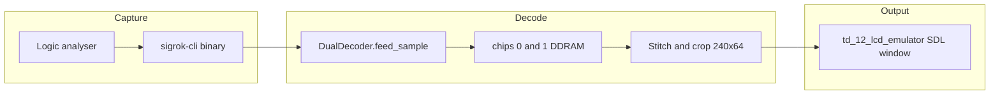
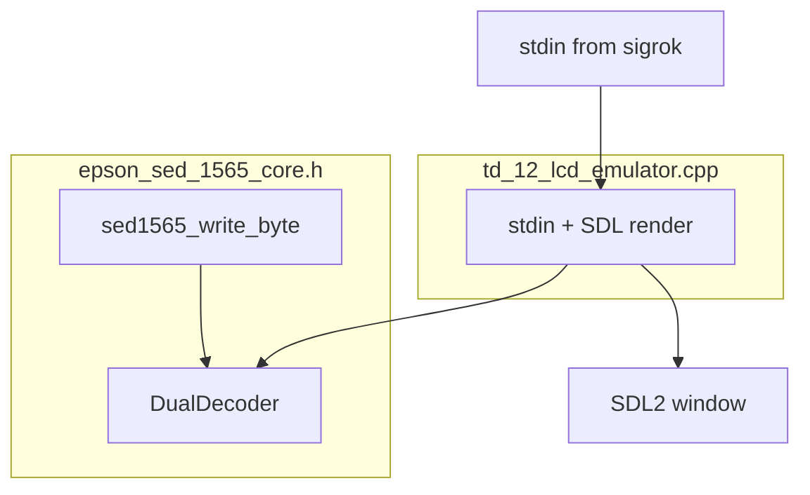

# Architecture

This document describes how the decoder and live viewer fit together. It complements the inline comments in the source files.

## High-level data flow



## File roles

| File | Layer | Responsibility |
|------|-------|----------------|
| `epson_sed_1565_core.h` | Core | SED1565 state, command/data handling, serial deserialisation, dual-die routing |
| `td_12_lcd_emulator.cpp` | Desktop transport + UI | stdin ingestion, sample stride, SDL texture render |
| `Makefile` | Build | Produces the emulator; links SDL2 |

The core header holds the protocol logic. The `.cpp` file is a thin wrapper for stdin input and SDL output.

## Display geometry

Constants used consistently across the project:

| Symbol | Value | Meaning |
|--------|-------|---------|
| `SED1565_CHIP_WIDTH` | 132 | Columns per die (SEG0..SEG131) |
| `SED1565_CHIP_HEIGHT` | 65 | 64 visible rows plus one indicator line |
| `TOTAL_BUFFER` | 264 | Both dies side by side |
| `VIEW_WIDTH` | 240 | Visible panel width after crop |
| `VIEW_HEIGHT` | 64 | Visible panel height |
| `LEFT_SHIFT` | 24 | Horizontal offset into the 264px stitched buffer |

### Die selection

`DualDecoder` stores two `Sed1565` structures:

- `chips[1]` = CS high = **left** die
- `chips[0]` = CS low = **right** die

### Mirroring and stitch

For each row `y`, the stitch step copies:

```
full_track[y][x]                   = chips[1].ddram[y][131 - x]           // left die
full_track[y][x + CHIP_WIDTH]      = chips[0].ddram[y][131 - x]           // right die
```

The viewport pixel at `(x, y)` reads `full_track[y][x + LEFT_SHIFT]`.

## Decoder core (`epson_sed_1565_core.h`)

### Per-die state (`Sed1565`)

- `ddram[65][132]`: decoded pixel bitmap (1 = on).
- `page`, `col`, `col_high`, `col_low`: addressing state from command bytes.
- `shift_reg`, `bit_idx`: serial deserialiser for logic-capture path.

### Command vs data (`sed1565_write_byte`)

When **A0 = 0** (command):

- `0xB0`..`0xB8`: set page (row block).
- `0x10`..`0x1F`: column address high nibble.
- `0x00`..`0x0F`: column address low nibble.
- Other commands: no effect on DDRAM in this emulator.

When **A0 = 1** (data):

- Each bit of the byte maps to one row within the current page (bit 0 = top of the 8-row strip).
- Column auto-increments after each data byte.

### Serial sampling (`DualDecoder::feed_sample`)

Input sample byte layout:

```
bit0 = MOSI
bit1 = SCLK
bit2 = A0
bit3 = CS
```

On each **rising edge** of SCLK:

1. Shift MOSI into the shift register of the die selected by CS.
2. After 8 bits, call `sed1565_write_byte` with the latched A0 at that edge.

**Idle detection:** if SCLK does not change for `SED1565_IDLE_RESET_SAMPLES` (default 100) consecutive samples, both dies reset their partial-byte state. This prevents misalignment across long clock gaps.

`feed_sample` returns `true` when a display-data byte (A0 = 1) completes, signalling that the raster may have changed.

## Desktop emulator (`td_12_lcd_emulator.cpp`)

### Threading model

- **Background thread:** blocks on `fread(stdin)`, pushes raw bytes into a mutex-protected deque.
- **Main thread:** SDL event loop; drains up to 131072 samples per tick, feeds the decoder, updates texture on mutation.

### Sample stride

Saleae Logic 16 binary output uses 2 bytes per sample. The processing loop advances by `SAMPLE_STRIDE = 2` and uses `processing_chunk[i]` (low byte only). An odd trailing byte stays in the buffer until the next chunk completes a pair.

### Rendering

On decode mutation:

1. Build `full_track` from both dies (mirrored stitch).
2. Fill an ARGB8888 pixel buffer (white on, black off).
3. `SDL_UpdateTexture` + `SDL_RenderPresent`.

Window size: `240 * 4` by `64 * 4` pixels (`SCALE = 4`).

## Future embedded path (STM32)

The header documents a second integration mode intended for production hardware:

1. MCU acts as SPI slave on MOSI/SCLK.
2. A0 and CS read as GPIOs.
3. On each completed byte, call `sed1565_write_byte(&dec.chips[cs], byte, a0)` directly (skip `feed_sample` bit deserialisation).
4. Use `chips[].ddram` as the source framebuffer for a replacement panel driver (for example SSD1322 encoding).

No embedded port ships in this repository yet; the desktop viewer validates the DDRAM model against real module traffic.

## Building blocks diagram



## See also

- [Usage guide](usage.md): commands and troubleshooting
- [Background](background.md): reverse-engineering narrative
